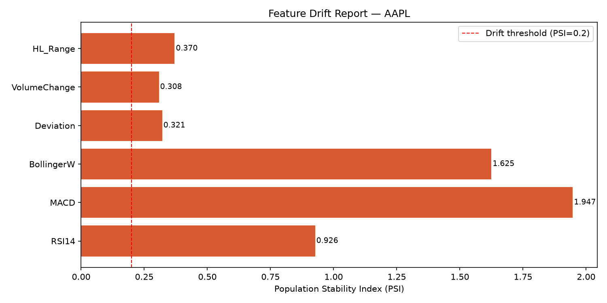
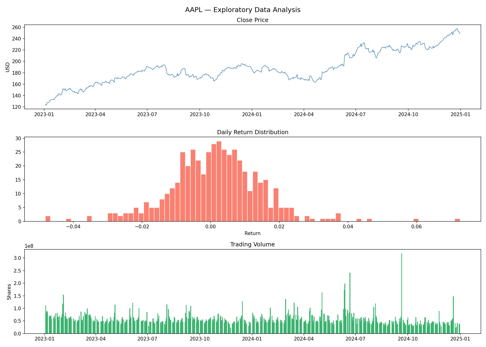
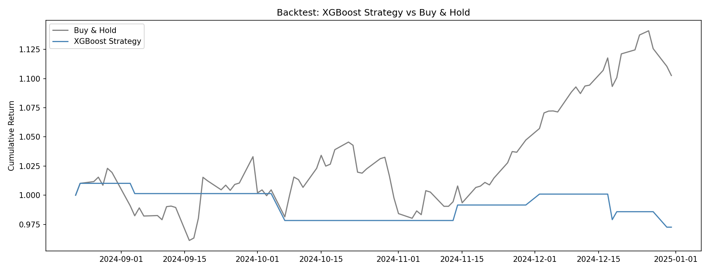
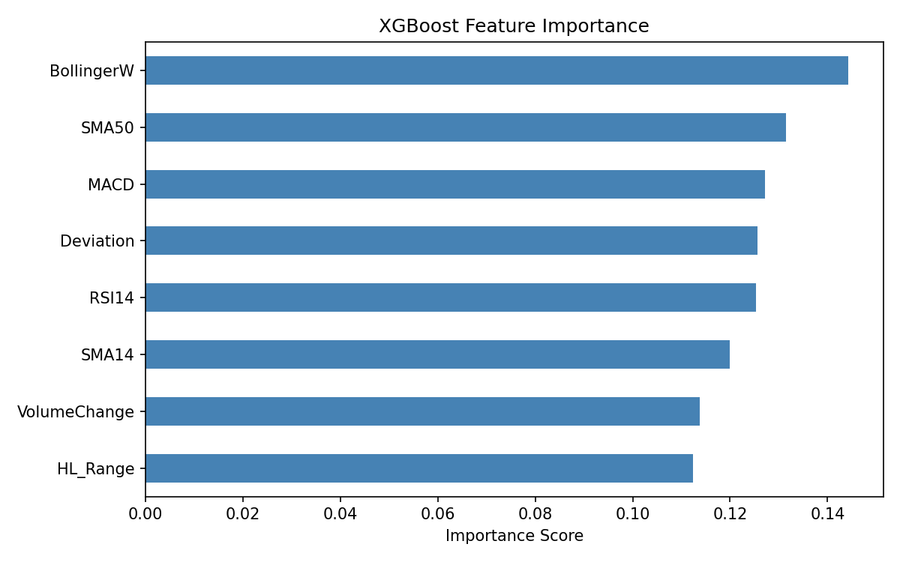

# 📈 Real-Time Stock Price Predictor


A full MLOps lifecycle project — transfer learning, experiment tracking, containerization, CI/CD, and drift detection — wrapped around a low-latency C++ inference engine. The same architecture pattern used in production quantitative trading systems.

```
  [BUY ]  2024-12-16  O=249.68  H=250.01  L=246.30  C=246.64  V=51694800
  [HOLD]  2024-12-17  O=252.10  H=252.45  L=248.42  C=248.72  V=51356400
  [BUY ]  2024-12-20  O=253.11  H=253.61  L=244.36  C=246.69  V=147495300
  [SELL]  2024-12-23  O=253.88  H=254.26  L=252.07  C=253.39  V=40858800
  [Benchmark] inference took 9 µs

  SUMMARY  BUY: 179   SELL: 181   HOLD: 117
```

---

## 🏗️ Architecture

```
┌──────────────────────────────────────────────────────────────────┐
│                    Python Training Pipeline                       │
│                                                                  │
│  yfinance         Feature Engineering        Transfer Learning   │
│  ^GSPC + AAPL → RSI · MACD · Bollinger · SMA → Parent → Child  │
│                                                                  │
│  MLflow Tracking → Experiment Comparison → ONNX Export          │
│  Drift Monitor   → PSI + KS Tests        → Retrain Verdict      │
│  Docker Container → Reproducible Training Environment           │
│  GitHub Actions  → Auto-train + Validate on every push          │
└───────────────────────────┬──────────────────────────────────────┘
                            │  model_child_AAPL.onnx
                            │  scaler_child_AAPL.csv
┌───────────────────────────▼──────────────────────────────────────┐
│                    C++ Inference Engine                           │
│                                                                  │
│  CSVLoader → PriceWindow → FeatureCalculator                     │
│           → ModelRunner (ONNX Runtime, dual-model)               │
│           → BUY / SELL / HOLD  @  ~9 µs/bar                     │
└──────────────────────────────────────────────────────────────────┘
```

---

## 🔬 Transfer Learning Results

Two-stage training: broad market first, individual stock second.

| Model | Role | Data | Accuracy | ROC-AUC |
|---|---|---|---|---|
| XGBoost on ^GSPC | Parent — broad market patterns | 5 years S&P 500 | 47.30% | 0.514 |
| Parent alone on AAPL | Baseline — no fine-tuning | 3 years AAPL | 53.19% | — |
| **Child (transfer learning)** | **Final model** | **3 years AAPL** | **51.77%** | **0.536** |

> The parent captures macro market behaviour (rate sensitivity, volatility regimes); the child inherits this and specialises on AAPL using the parent's probability as a 9th input feature — the XGBoost equivalent of fine-tuning a neural network.


---

## 🔍 Drift Detection

Compares the model's training distribution (reference) against the most recent 30 trading days (current) using PSI and Kolmogorov-Smirnov tests across 6 normalized features. Raw price-scale features (SMA14, SMA50) are computed but excluded from the verdict — they always show apparent "drift" for a trending stock, which is a known pitfall in naive drift detection setups.

| Feature | PSI | KS p-value | Verdict |
|---|---|---|---|
| RSI14 | 0.926 | 0.009 | Drifted |
| MACD | 1.947 | 0.000 | Drifted |
| BollingerW | 1.625 | 0.000 | Drifted |
| Deviation | 0.321 | 0.501 | Drifted |
| VolumeChange | 0.308 | 0.771 | Drifted |
| HL_Range | 0.370 | 0.023 | Drifted |

**Result: 6/6 normalized features drifted → Retrain recommended.** This correctly identified that AAPL's recent 30-day window has entered a stronger, more volatile trending regime than the model's 3-year training period — a legitimate, actionable signal.



---

## 📊 Results





**Backtest accuracy: ~60% on Dec 2024 AAPL data (vs 50% random baseline)**
Signal distribution on 477 bars: **BUY 179 · SELL 181 · HOLD 117**

---

## ✨ Features

**Python pipeline**
- Downloads OHLCV data via `yfinance` for any ticker
- Engineers 8 technical indicators: SMA14, SMA50, RSI14 (Wilder smoothing), MACD, Bollinger Band Width, Price Deviation, Volume Change, HL Range
- Transfer learning: trains parent on ^GSPC, fine-tunes child on AAPL
- Compares 3 baseline models: Logistic Regression, SVM, XGBoost
- Backtests strategy vs buy-and-hold with cumulative return chart
- Full MLflow experiment tracking — every run logged with params + metrics
- Exports to ONNX for C++ consumption; saves scaler params for normalization

**C++ inference engine**
- `PriceBar` — OHLCV struct with `operator<<` overloading
- `PriceWindow` — fixed-size rolling buffer using `std::deque`
- `FeatureCalculator` — RSI, MACD, Bollinger Width, SMA (static methods)
- `ModelRunner` — dual ONNX Runtime sessions (parent + child), StandardScaler normalization
- `CSVLoader` — robust CSV parser with error handling
- `Benchmark` — RAII microsecond timer using `std::chrono`
- `StockPredictor` — top-level orchestrator with BUY/SELL/HOLD summary

**MLOps**
- MLflow experiment tracking with SQLite backend
- Docker containerization — one command reproduces training
- GitHub Actions CI/CD — auto-trains and validates accuracy on every push
- Accuracy threshold gate: pipeline fails if model drops below 52%
- Drift detection — PSI + KS tests with price-scale feature exclusion, JSON report output, CI/CD-compatible exit codes

---

## 📁 Project Structure

```
stock-predictor/
├── .github/
│   └── workflows/
│       └── train.yml              # CI/CD — auto-trains on push to main
├── assets/
│   ├── backtest.png
│   ├── eda.png
│   ├── feature_importance.png
│   ├── transfer_report.png        # parent vs child accuracy comparison
│   └── drift_report.png           # PSI drift chart per feature
├── cpp/
│   ├── stock_predictor.cpp        # C++ inference engine (7 classes)
│   ├── model_child_AAPL.onnx      # fine-tuned child model
│   ├── model_parent_GSPC.onnx     # parent model (S&P 500)
│   └── scaler_child_AAPL.csv      # StandardScaler params for C++
├── python/
│   ├── stock_prediction.py        # EDA + baseline model training
│   ├── transfer_learning.py       # transfer learning pipeline + MLflow
│   └── drift_monitor.py           # PSI/KS drift detection
├── Dockerfile                     # containerized training environment
├── docker-compose.yml
├── requirements.txt
└── README.md
```

---

## 🚀 Quickstart

### Option A — Docker (recommended)

```bash
git clone https://github.com/m18kart/stock-predictor.git
cd stock-predictor
docker build -t stock-predictor .
docker run -p 5001:5000 stock-predictor
# MLflow UI → http://localhost:5001
```

### Option B — Local Python

```bash
git clone https://github.com/m18kart/stock-predictor.git
cd stock-predictor
python3.11 -m venv .venv && source .venv/bin/activate
pip install -r requirements.txt

# Baseline training (EDA + 3 model comparison)
python python/stock_prediction.py

# Transfer learning (parent ^GSPC → child AAPL)
python python/transfer_learning.py

# Check for data drift
python python/drift_monitor.py AAPL

# View experiment results
mlflow ui --backend-store-uri sqlite:///mlflow.db
# Open http://localhost:5000
```

### Option C — C++ Inference Engine

```bash
# macOS
brew install onnxruntime
g++ -std=c++17 -O2 -Wall cpp/stock_predictor.cpp \
    -I/opt/homebrew/include \
    -L/opt/homebrew/lib \
    -lonnxruntime \
    -o stock_predictor

# Generate AAPL data
python -c "import yfinance as yf; yf.download('AAPL', period='1y').to_csv('AAPL.csv')"

# Run with transfer learning models
./stock_predictor AAPL.csv cpp/model_child_AAPL.onnx cpp/model_parent_GSPC.onnx
```

---

## 🔁 CI/CD Pipeline

Every push to `main` that touches `python/` triggers GitHub Actions:

```
Push to main
    → Install Python 3.11 + dependencies
    → Train parent model on ^GSPC (5 years)
    → Fine-tune child model on AAPL (3 years)
    → Validate: child accuracy must exceed 52%
    → Upload model_child_AAPL.onnx as build artifact
    → Post full metrics summary to Actions log
```

If accuracy drops below threshold the pipeline **fails and blocks the commit** — preventing model regressions from reaching production. `drift_monitor.py` returns exit code 1 when retrain is recommended, ready to be wired in as a scheduled check.

---

## 🧠 C++ Concepts Demonstrated

| Concept | Where |
|---|---|
| Structs + `operator<<` overloading | `PriceBar` |
| OOP class design | All 7 classes |
| `std::deque` rolling buffer | `PriceWindow` |
| Static methods + STL algorithms | `FeatureCalculator` |
| File I/O + `std::istringstream` parsing | `CSVLoader` |
| RAII destructor pattern | `Benchmark` |
| `std::chrono` microsecond timing | `Benchmark` |
| Third-party library integration | ONNX Runtime in `ModelRunner` |
| `enum class` | `Signal` |
| Dual-session inference | `ModelRunner` (parent + child) |

---

## 📦 Requirements

**Python 3.11+**
```
yfinance, pandas, numpy, scipy, scikit-learn
xgboost, onnxmltools, onnxruntime
mlflow, seaborn, matplotlib
```

**C++17**
- ONNX Runtime (`brew install onnxruntime` / `apt install libonnxruntime-dev`)

---

## 🗺️ Roadmap

- [x] XGBoost training pipeline with 8 technical indicators
- [x] Transfer learning — S&P 500 parent → AAPL child model
- [x] ONNX export + C++ dual-model inference at ~9 µs/bar
- [x] MLflow experiment tracking and model comparison
- [x] Docker containerization
- [x] GitHub Actions CI/CD with accuracy validation gate
- [x] Data drift detection — PSI + KS tests, price-scale feature exclusion
- [ ] Multi-agent financial report generation (LangGraph)
- [ ] Real-time serving with FastAPI + Redis caching
- [ ] Observability stack — Prometheus + Grafana
- [ ] Live WebSocket feed (`runLive()` in C++)
- [ ] Extend to multiple tickers (MSFT, GOOGL, TSLA)

---

## ⚠️ Disclaimer

This project is for **educational purposes only**. Signals generated are not financial advice and should not be used for real trading decisions.

---

## 👤 Author

**Karthik Maheswaran** — ML engineer combining Python data pipelines with C++ systems programming.

[](https://github.com/m18kart)
